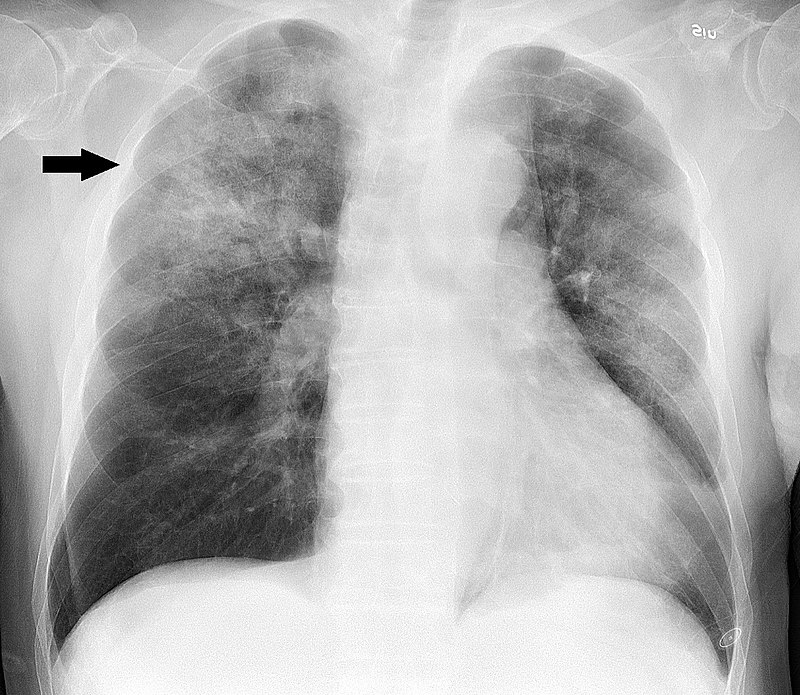
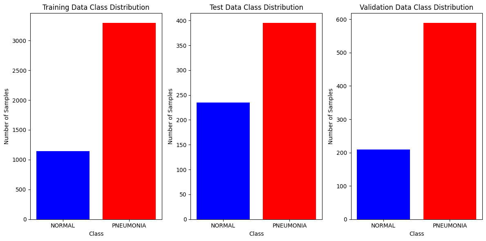
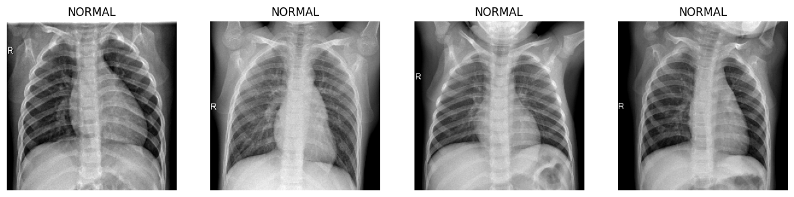
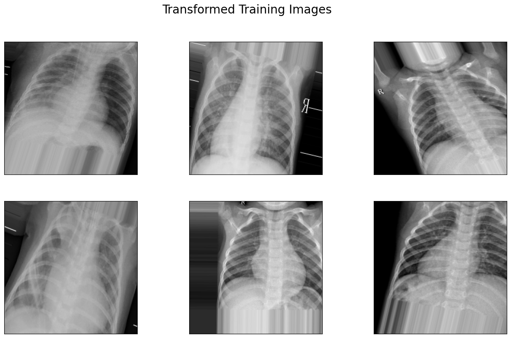
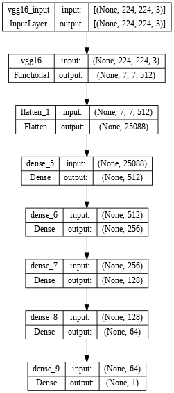
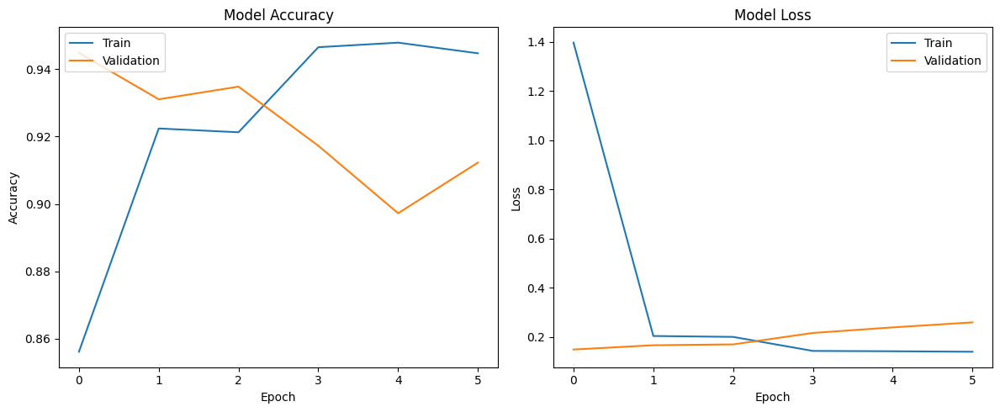
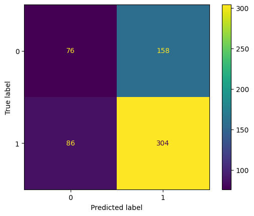
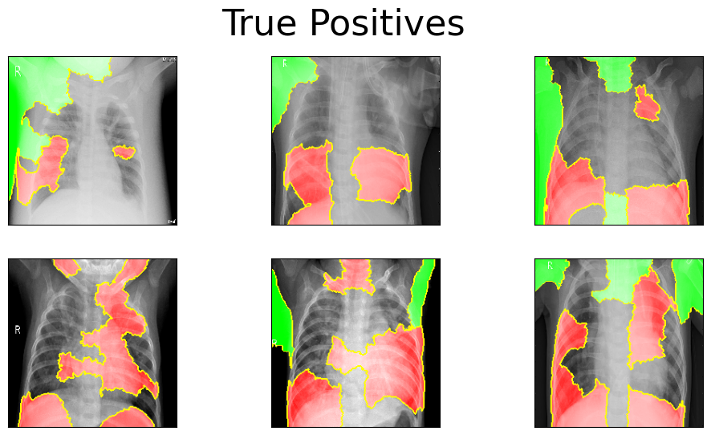
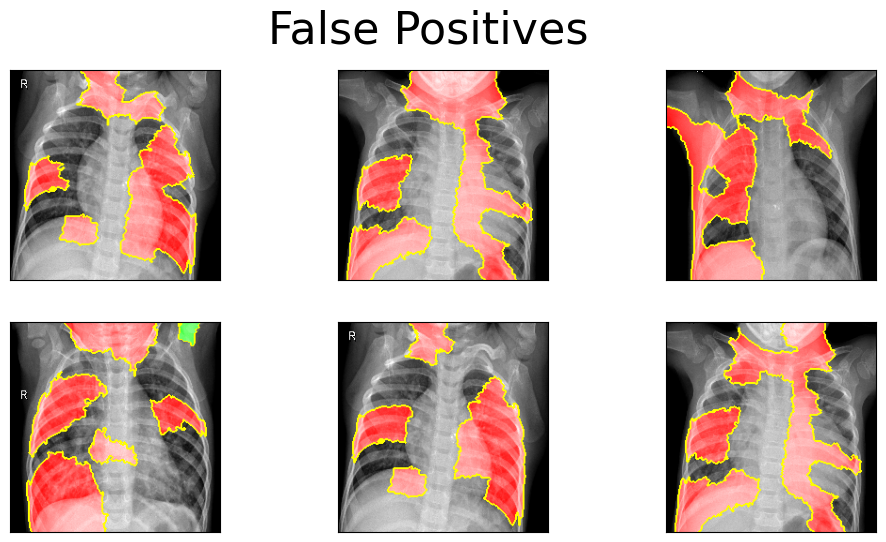

# Image Classification with Deep Learning

## Project Overview

Welcome to the Image Classification with Deep Learning project, where we tackle critical healthcare challenges in collaboration with Nour Medicine, an innovative healthcare technology company. Childhood pneumonia is a major global health concern, and timely diagnosis is vital for saving lives.

**Project Mission**: Our primary objective is to leverage deep learning to detect pneumonia in chest X-ray images. By doing so, we empower healthcare providers, especially in underserved regions, and contribute to Nour Medicine's mission of enhancing global health outcomes.

## Data Preparation

We obtained our dataset from [Kaggle](https://www.kaggle.com/paultimothymooney/chest-xray-pneumonia), which contains thousands of chest X-rays from children with and without pneumonia. To address the issue of a small validation dataset, we manually moved 20% of the training data into the validation folder. This ensures more robust model evaluation.

### Handling Class Imbalance

Our dataset exhibits class imbalance, with roughly a 3:1 ratio in the training and validation datasets and a 2:1 ratio in the test dataset. While not ideal, this imbalance should not significantly skew our model evaluation metrics.

### Visualizing X-Ray Examples

We've included examples of X-ray images in our analysis. The top four images depict healthy X-rays without pneumonia, while the last four images show X-rays with pneumonia.

Additionally, we applied image transformations, including rotation and other augmentations, to better prepare our model for real-world data.

### Model Development

Despite the class imbalance, we prioritized **Accuracy** as our primary model evaluation metric, aiming to maximize correct classifications. We explored various convolutional neural network (CNN) architectures and hyperparameters:

1. [Baseline Model](Notebooks/baseline_model.ipynb): A simple neural network with convolutional and Dense layers.
2. [Model 2](Notebooks/model2.ipynb): Improved by adding more layers.
3. [Model 3](Notebooks/model3.ipynb): Enhanced with regularization through Dropout layers.
4. [Model 4](Notebooks/model4): Incorporating learning rate decay for each epoch.
5. [Model 5](Notebooks/model5.ipynb): Leveraging Double Convolutional Layers.
6. [Model 6](Notebooks/model6.ipynb): Maximizing both convolutional and dense layers for comprehensive pattern recognition.

The last two models are based on other CNN architectures (Transfer Learning) and are explored further in this [notebook](final.ipynb):

## Model Comparison

Our top-performing models achieved test accuracies of 84% and 86%, respectively.

## Best Model - VGG16 with Learning Rate Decay

Our best model, Model 8, utilizes VGG16 as its convolutional base and is augmented with densely connected layers for image classification. 

## Model Results

Model 8 achieved an impressive **86% accuracy** on the test dataset. The model excels in classifying positive cases, aligning with the training data's positive bias.

### Confusion Matrix

## Interpretation of Results

We employed Lime to interpret the model's decision-making process. Lime's visualizations highlight areas where pneumonia is likely (green) or unlikely (red). The model primarily focuses on lung areas, consistent with pneumonia patterns. Some unexpected behavior, like focusing outside the body, may relate to body weight's impact on pneumonia susceptibility.

- True Positives for Model 8

- False Positives for Model 8

## Intermediate Layer Activations

Understanding what each convolutional layer "sees" is fascinating. The image below illustrates the activation of the first neuron in each convolutional layer, demonstrating how each layer focuses on increasingly specific image patterns.

## Conclusion

Our final model empowers Nour Medicine to diagnose pneumonia from chest X-rays, particularly in regions with a high prevalence of pneumonia. Patients can receive timely treatment without the need for specialized radiologists.

Future work includes further training the model with additional data to improve accuracy.

## Repository Information

- **Notebooks**: Jupyter notebooks for various models.
- **Images**: Graphs generated from code.
- **Final.ipynb**: Jupyter notebook containing the full analysis.
- **slides.pdf**: PDF version of the project presentation.
- **README.md**: The top-level README for this project.
